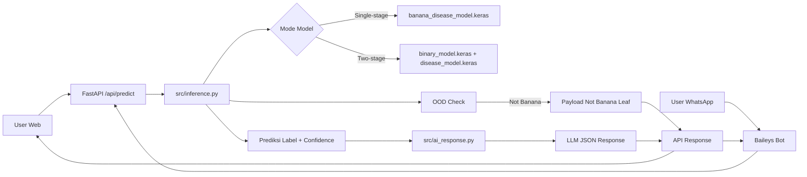
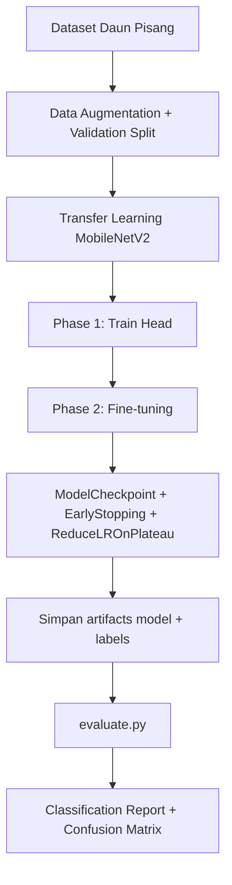
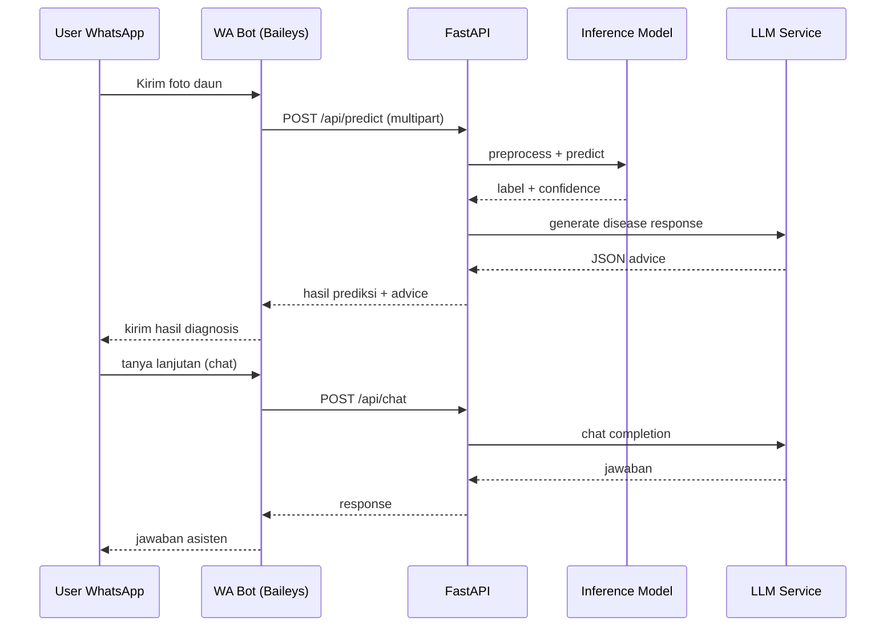

# Panduan Belajar Ujian Skripsi - Banana Doctor AI

Dokumen ini disusun untuk persiapan presentasi dan tanya-jawab ujian skripsi berdasarkan implementasi nyata di codebase proyek Banana Doctor AI.

## 1. Elevator Pitch (30 detik)

Banana Doctor AI adalah sistem diagnosis penyakit daun pisang berbasis Computer Vision dan LLM.
Sistem menerima gambar daun, melakukan klasifikasi penyakit menggunakan MobileNetV2, lalu menghasilkan rekomendasi penanganan melalui asisten AI.
Sistem tersedia di web dashboard FastAPI dan integrasi WhatsApp bot untuk akses petani secara langsung.

## 2. Arsitektur Sistem End-to-End

Alur utama:

1. User mengirim foto dari Web atau WhatsApp.
2. Backend FastAPI menerima file gambar.
3. Modul inferensi melakukan preprocessing dan prediksi model.
4. Sistem menambahkan informasi penyakit statis.
5. Jika gambar valid daun pisang dan penyakit terdeteksi, LLM membangkitkan rekomendasi tindakan.
6. Hasil dikembalikan ke frontend atau WhatsApp bot.

Komponen kunci:

1. Training single-stage: train.py
2. Training two-stage: train_two_stage.py
3. Evaluasi model: evaluate.py
4. Inferensi + OOD check: src/inference.py
5. AI response + chat: src/ai_response.py
6. API server: api.py
7. Frontend web: frontend/index.html + frontend/js/app_v2.js
8. WhatsApp bot: whatsapp-bot/bot.js

## 3. Mapping File Penting untuk Presentasi

1. Backend API: [api.py](api.py)
2. Inference core: [src/inference.py](src/inference.py)
3. LLM integration: [src/ai_response.py](src/ai_response.py)
4. Training single-stage: [train.py](train.py)
5. Training two-stage: [train_two_stage.py](train_two_stage.py)
6. Evaluation: [evaluate.py](evaluate.py)
7. Frontend entry: [frontend/index.html](frontend/index.html)
8. Frontend logic: [frontend/js/app_v2.js](frontend/js/app_v2.js)
9. WhatsApp bot: [whatsapp-bot/bot.js](whatsapp-bot/bot.js)
10. Dependency Python: [requirements.txt](requirements.txt)
11. Label artifacts: [artifacts/labels.json](artifacts/labels.json), [artifacts/binary_labels.json](artifacts/binary_labels.json), [artifacts/disease_labels.json](artifacts/disease_labels.json)

## 4. Konsep ML yang Harus Siap Dijelaskan

### 4.1 Dataset dan Kelas

Kelas utama model single-stage:

1. Cordana
2. Healthy
3. Panama Disease
4. Yellow and Black Sigatoka

### 4.2 Kenapa MobileNetV2

Argumen akademik yang bisa dipakai:

1. Ringan dan cepat untuk inference real-time.
2. Cocok untuk deployment di perangkat terbatas.
3. Transfer learning dari ImageNet mempercepat konvergensi.

### 4.3 Data Augmentation

Di training, augmentation meliputi:

1. Rotation
2. Shift horizontal/vertikal
3. Shear
4. Zoom
5. Horizontal flip

Tujuan: mengurangi overfitting dan memperkaya variasi data latih.

### 4.4 Imbalanced Data dan Class Weight

Model menghitung class weight untuk menekan bias kelas mayoritas.
Poin pembelaan skripsi:

1. Tanpa class weight, model cenderung menebak kelas dominan.
2. Dengan class weight, penalti loss untuk kelas minoritas diperbesar.

### 4.5 Two-Stage Training

Tahap 1: klasifikasi biner Healthy vs Diseased.
Tahap 2: jika Diseased, klasifikasi detail penyakit (Cordana, Panama, Sigatoka).

Kelebihan yang bisa dijelaskan:

1. Decision boundary awal lebih sederhana.
2. Spesialisasi kelas sakit dapat meningkatkan robustness.
3. Mudah dianalisis sebagai hierarchical classifier.

## 5. Detail Training Script yang Perlu Dikuasai

### 5.1 train.py (single-stage)

Yang harus Anda pahami:

1. Validation split 20% di ImageDataGenerator.
2. Menyimpan labels ke artifacts/labels.json.
3. Phase 1: train classifier head saat backbone dibekukan.
4. Phase 2: fine-tuning sebagian layer backbone.
5. Callback: ModelCheckpoint, EarlyStopping, ReduceLROnPlateau.
6. Loss memakai label smoothing.

### 5.2 train_two_stage.py

Yang harus Anda pahami:

1. Membuat data temporary binary Healthy vs Diseased.
2. Melatih model biner lalu model disease-only.
3. Menyimpan model dan label terpisah:
    1. binary_model.keras + binary_labels.json
    2. disease_model.keras + disease_labels.json
4. Menyimpan training_config.json untuk mapping healthy_class dan diseased_label.

## 6. Detail Inferensi dan Alasan Desain

Bagian penting dari src/inference.py:

1. Support dua mode artifact: single-stage atau two-stage.
2. Preprocess konsisten dengan training (resize 224, normalisasi 0-1).
3. OOD check memakai MobileNetV2 ImageNet top-20 decode.
4. Rule-based blokir untuk objek non-plant (misalnya tangan/wajah/kendaraan).
5. Payload khusus Not Banana Leaf untuk menghindari diagnosis palsu.

Pertanyaan dosen yang sering muncul:

1. Kenapa ada OOD layer tambahan?
    Jawab: untuk meningkatkan keamanan prediksi dan mencegah false diagnosis saat input bukan daun pisang.
2. Kenapa threshold dipilih rule-based?
    Jawab: sebagai baseline heuristik yang interpretabel dan mudah diaudit di tahap riset awal.

## 7. Integrasi LLM yang Harus Siap Dijelaskan

Bagian utama di src/ai_response.py:

1. Runtime config melalui environment, .env, atau streamlit secrets.
2. Prompt sistem memaksa format JSON terstruktur.
3. Response dinormalisasi agar frontend stabil.
4. AI response tidak dihasilkan untuk label Healthy (efisiensi token).

Argumen akademik:

1. CV menangani klasifikasi visual.
2. LLM menangani natural language explanation + recommendation.
3. Pemisahan tugas menurunkan kompleksitas model tunggal end-to-end.

## 8. API Layer dan Endpoint

Endpoint penting di api.py:

1. POST /api/predict
    1. Input: file gambar
    2. Output: label, confidence, top_predictions, disease_info, ai_response
2. POST /api/chat
    1. Input: riwayat messages
    2. Output: jawaban assistant

Poin teknis yang bagus untuk ujian:

1. Inferensi dijalankan di executor agar tidak blocking event loop async FastAPI.
2. Static frontend di-mount langsung dari backend sehingga deployment lebih sederhana.

## 9. Frontend Web (Dashboard)

Yang perlu Anda kuasai dari frontend:

1. Ada 2 mode halaman: landing page dan app dashboard.
2. Dashboard memiliki 3 tab:
    1. Pusat Diagnosis
    2. Asisten Tanya Jawab
    3. Katalog Penyakit
3. Upload gambar via drag-drop lalu fetch ke /api/predict.
4. Hasil confidence divisualkan dengan circular progress.
5. Chat frontend mengirim context hasil diagnosis ke endpoint /api/chat.

File utama:

1. [frontend/index.html](frontend/index.html)
2. [frontend/js/app_v2.js](frontend/js/app_v2.js)
3. [frontend/css/styles_v2.css](frontend/css/styles_v2.css)

## 10. WhatsApp Bot (Bagian Wajib Saat Ujian)

Yang terjadi di whatsapp-bot/bot.js:

1. Koneksi WA via Baileys + QR pairing.
2. Saat user kirim gambar:
    1. Bot download media.
    2. Bot kirim ke backend /api/predict.
    3. Bot format hasil diagnosis ke teks WhatsApp.
3. Bot simpan session per user (lastPrediction + chatHistory).
4. Jika user kirim teks setelah diagnosis:
    1. Bot kirim context + history ke /api/chat.
    2. Bot kirim balik jawaban AI.
5. Command reset untuk hapus session.

Nilai jual skripsi:

1. Aksesibilitas tinggi (petani tidak wajib buka web app).
2. Integrasi multimodal image-to-advice melalui platform populer.
3. Session-aware consultation, bukan sekadar one-shot prediction.

## 11. Skenario Demo Ujian (Runbook)

### 11.1 Persiapan

1. Install dependency Python dari requirements.txt.
2. Install dependency Node di whatsapp-bot.
3. Siapkan file .env untuk API key LLM.

### 11.2 Jalankan Sistem

1. Jalankan backend FastAPI.
2. Buka web di root endpoint dan tunjukkan alur upload sampai hasil.
3. Jalankan WhatsApp bot, scan QR, kirim foto sample.
4. Lanjutkan dengan tanya-jawab follow-up di WhatsApp untuk menunjukkan context-aware chat.

### 11.3 Script Narasi Demo

Narasi singkat yang bisa Anda ucapkan:

1. Saya unggah foto daun, sistem melakukan preprocessing dan klasifikasi.
2. Model mengembalikan label penyakit serta confidence.
3. Layer LLM menghasilkan rekomendasi tindakan terstruktur.
4. Alur yang sama tersedia di WhatsApp untuk kemudahan petani di lapangan.

## 12. Pertanyaan Dosen dan Jawaban Singkat

1. Kenapa tidak pakai model yang lebih besar?
    Jawab: target sistem adalah kecepatan inferensi dan kemudahan deployment; MobileNetV2 memberi trade-off baik antara akurasi dan latency.

2. Apa perbedaan single-stage vs two-stage?
    Jawab: single-stage langsung multi-class, two-stage memecah keputusan jadi Healthy-vs-Diseased lalu klasifikasi detail penyakit untuk spesialisasi.

3. Bagaimana menangani input bukan daun pisang?
    Jawab: ada OOD check berbasis prediksi ImageNet non-plant dan fallback payload Not Banana Leaf.

4. Bagaimana menjamin response AI konsisten?
    Jawab: gunakan system prompt ketat, format JSON wajib, parsing + normalisasi response.

5. Apa keterbatasan sistem?
    Jawab: sensitif pada kualitas citra, domain dataset, serta potensi variasi lapangan yang belum tercakup.

6. Pengembangan berikutnya?
    Jawab: tambah data lintas wilayah, validasi lapangan bersama ahli tanaman, quantization, dan active learning.

## 13. Rumus Penting untuk Ujian Skripsi

Bagian ini dibuat agar Anda punya amunisi matematis saat dosen masuk ke detail metodologi.

### 13.1 Softmax (probabilitas multi-kelas)

$$
p_i = \frac{e^{z_i}}{\sum_{j=1}^{K} e^{z_j}}
$$

Keterangan:

1. $z_i$ adalah logit kelas ke-$i$.
2. $p_i$ adalah probabilitas kelas ke-$i$.
3. $K$ adalah jumlah kelas.

### 13.2 Categorical Cross Entropy dengan Class Weight

Secara konsep loss per sampel:

$$
\mathcal{L} = - \sum_{i=1}^{K} w_i \cdot y_i \log(p_i)
$$

Keterangan:

1. $y_i$ adalah target kelas (setelah smoothing jika digunakan).
2. $p_i$ adalah probabilitas prediksi.
3. $w_i$ adalah class weight untuk mengatasi data imbalance.

### 13.3 Label Smoothing

Jika smoothing $\varepsilon$ digunakan, target menjadi:

$$
y_i' = (1-\varepsilon)\,y_i + \frac{\varepsilon}{K}
$$

Intuisi: model tidak terlalu over-confident pada satu kelas.

### 13.4 Rumus Confidence Two-Stage (sesuai implementasi)

Jika prediksi akhir adalah Healthy:

$$
conf_{final} = P(Healthy)
$$

Jika prediksi akhir adalah penyakit tertentu:

$$
conf_{final} = P(Diseased) \times P(Disease_k \mid Diseased)
$$

### 13.5 Metrik Evaluasi Klasifikasi

1. Accuracy:

$$
Accuracy = \frac{TP + TN}{TP + TN + FP + FN}
$$

2. Precision:

$$
Precision = \frac{TP}{TP + FP}
$$

3. Recall:

$$
Recall = \frac{TP}{TP + FN}
$$

4. F1-Score:

$$
F1 = 2 \cdot \frac{\text{Precision} \cdot \text{Recall}}{\text{Precision} + \text{Recall}}
$$

### 13.6 Aturan OOD di Sistem (ringkas)

1. Tolak langsung jika skor non-plant tinggi:

$$
s_{nonplant} \ge 0.60 \Rightarrow Not\ Banana\ Leaf
$$

2. Tolak jika confidence model rendah dan indikasi non-plant cukup kuat:

$$
conf_{model} < 0.30 \land s_{nonplant} \ge 0.30 \Rightarrow Not\ Banana\ Leaf
$$

## 14. Mermaid Chart untuk Slide Skripsi

Silakan copy langsung chart ini ke markdown slide atau dokumen presentasi.

### 14.1 Chart Arsitektur End-to-End

### 14.2 Chart Pipeline Training

### 14.3 Chart Alur Konsultasi WhatsApp

## 15. Keterbatasan dan Risiko yang Harus Jujur Disampaikan

1. Model masih bergantung pada kualitas foto.
2. OOD saat ini masih heuristik threshold.
3. LLM dapat menghasilkan rekomendasi yang perlu verifikasi agronom.
4. Belum ada MLOps pipeline otomatis untuk retraining berkala.

## 16. Checklist Hafalan 1 Hari Sebelum Ujian

1. Hafal arsitektur end-to-end (Web/WA -> API -> Inference -> LLM).
2. Hafal beda single-stage dan two-stage.
3. Hafal alasan class weight, label smoothing, dan fine-tuning.
4. Hafal alasan OOD check dan payload Not Banana Leaf.
5. Hafal alur session management di WhatsApp bot.
6. Siapkan 2-3 contoh pertanyaan dosen dan jawaban ringkas.
7. Latihan demo 1x tanpa internet stabil, 1x dengan internet stabil.

## 17. Lampiran Perintah Cepat

1. Menjalankan backend API:
    uvicorn api:app --reload
2. Menjalankan training single-stage:
    python3 train.py
3. Menjalankan training two-stage:
    python3 train_two_stage.py
4. Menjalankan evaluasi:
    python3 evaluate.py
5. Menjalankan WhatsApp bot:
    cd whatsapp-bot
    npm install
    npm start

Semoga lancar ujian skripsinya. Fokuskan presentasi pada kontribusi sistem nyata, keputusan teknis yang dapat dipertanggungjawabkan, serta hasil implementasi end-to-end dari training hingga konsultasi WhatsApp.
