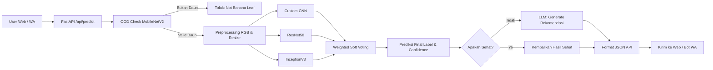

# Panduan Belajar Ujian Skripsi - Banana Doctor AI

Dokumen ini disusun untuk persiapan presentasi dan tanya-jawab ujian skripsi berdasarkan implementasi nyata di codebase proyek Banana Doctor AI, yang kini menggunakan arsitektur Ensemble Model (Gabungan 3 Model) untuk klasifikasi 7 kondisi daun pisang.

## 1. Elevator Pitch (30 detik)

Banana Doctor AI adalah sistem diagnosis penyakit daun pisang mutakhir berbasis Computer Vision (Ensemble Learning) dan Large Language Model (LLM). 
Sistem menerima gambar daun, melakukan verifikasi objek (apakah benar daun pisang) menggunakan MobileNetV2 sebagai detektor *Out-Of-Distribution* (OOD), lalu melakukan klasifikasi penyakit secara akurat menggunakan gabungan 3 model (Custom CNN, ResNet50, InceptionV3) dengan teknik *Weighted Soft Voting*. Terakhir, LLM menghasilkan rekomendasi penanganan yang spesifik dan praktis. Sistem ini tersedia di web dashboard FastAPI dan terintegrasi langsung dengan WhatsApp bot untuk kemudahan akses petani di lapangan.

## 2. Arsitektur Sistem End-to-End

Alur utama:

1. User mengirim foto dari Web atau WhatsApp.
2. Backend FastAPI menerima file gambar.
3. Modul inferensi melakukan *Out-Of-Distribution (OOD) check*. Jika terdeteksi bukan daun pisang (misal: screenshot, wajah, kendaraan), proses dihentikan.
4. Jika valid, sistem memproses gambar dengan 3 model AI (Ensemble) dan melakukan *Weighted Soft Voting* untuk menentukan hasil akhir.
5. Sistem mengambil informasi statis dari database untuk penyakit terkait.
6. Jika prediksi adalah penyakit (bukan daun sehat), LLM membangkitkan rekomendasi tindakan medis pertanian.
7. Hasil dikembalikan ke frontend atau WhatsApp bot.

Komponen kunci:

1. Training Ensemble: `train.py`
2. Evaluasi model: `evaluate.py`
3. Inferensi + OOD + Soft Voting: `src/inference.py`
4. AI response + chat: `src/ai_response.py`
5. API server: `api.py`
6. Frontend web: `frontend/index.html` + `frontend/js/app_v2.js`
7. WhatsApp bot: `whatsapp-bot/bot.js`

## 3. Mapping File Penting untuk Presentasi

1. Backend API: `api.py`
2. Inference core: `src/inference.py`
3. LLM integration: `src/ai_response.py`
4. Training script: `train.py`
5. Evaluation script: `evaluate.py`
6. Frontend entry: `frontend/index.html`
7. Frontend logic: `frontend/js/app_v2.js`
8. WhatsApp bot: `whatsapp-bot/bot.js`
9. Konfigurasi Ensemble: `artifacts/ensemble_config.json`
10. Daftar Label: `artifacts/labels.json`

## 4. Konsep Machine Learning yang Harus Siap Dijelaskan

### 4.1 Dataset dan 7 Kelas Klasifikasi

Model dilatih menggunakan dataset Kaggle berukuran besar yang mencakup 7 kelas:

1. Black Sigatoka Disease (Sigatoka Hitam)
2. Bract Mosaic Virus Disease (Virus Mosaik Seludang)
3. Healthy Leaf (Daun Sehat)
4. Insect Pest Disease (Hama Serangga)
5. Moko Disease (Layu Bakteri)
6. Panama Disease (Layu Fusarium)
7. Yellow Sigatoka Disease (Sigatoka Kuning)

### 4.2 Arsitektur Ensemble Learning (Penting untuk Skripsi)

Sistem menggunakan teknik **Ensemble Learning** dengan metode **Weighted Soft Voting**.
Artinya, kita tidak hanya mengandalkan 1 model, melainkan 3 model sekaligus:
1. **Custom CNN**: Arsitektur ringan buatan sendiri yang dilatih dari awal.
2. **ResNet50**: Pre-trained model (Transfer Learning) yang andal dalam mengekstrak fitur residual.
3. **InceptionV3**: Pre-trained model yang andal mengekstrak fitur pada berbagai skala (inception modules).

**Kenapa Ensemble?**
Argumen akademik: Menggabungkan beberapa model dengan arsitektur berbeda dapat mengurangi varians (overfitting), menutupi kelemahan satu model dengan kelebihan model lain, dan menghasilkan prediksi akhir yang jauh lebih stabil (robust) dibanding model tunggal.

### 4.3 Weighted Soft Voting

Model menggunakan rata-rata terbobot (Weighted Soft Voting). Jika akurasi model ResNet50 lebih rendah (misal 65%) dibanding CNN dan InceptionV3 (misal 90%), sistem akan **memberikan bobot lebih kecil** pada keputusan ResNet50 dan **bobot lebih besar** pada CNN/Inception. Ini mencegah model yang lemah merusak hasil akhir.

### 4.4 Out-Of-Distribution (OOD) Check

Sebelum gambar dianalisa penyakitnya, sistem menggunakan model **MobileNetV2** murni untuk mendeteksi apakah ini gambar tumbuhan atau bukan. Jika terdeteksi hal-hal seperti `hand, face, car, phone, website, screenshot, text, room`, sistem akan memblokir proses klasifikasi penyakit.

## 5. Detail Training Script (`train.py`)

Yang harus Anda pahami:

1. Semua 3 model dilatih secara terpisah dalam satu script.
2. Data Augmentation: Rotation, Shift, Shear, Zoom, Horizontal Flip.
3. **Callback MLOps**: 
    - `ModelCheckpoint`: Menyimpan model hanya saat akurasi validasi terbaik (`best_cnn.keras`, dsb).
    - `EarlyStopping`: Berhenti training jika tidak ada peningkatan (mencegah overfitting).
    - `ReduceLROnPlateau`: Menurunkan learning rate jika akurasi *nyangkut* (plateau).
4. Menyimpan konfigurasi ke `artifacts/ensemble_config.json` (termasuk bobot akurasi masing-masing model).

## 6. Detail Inferensi dan Alasan Desain (`src/inference.py`)

1. Load `artifacts/ensemble_config.json` dan memuat ketiga model.
2. **Preprocessing**: Resize (224x224), konversi RGB, normalisasi (0-1).
3. **OOD Check**: Top-20 ImageNet digabung skornya. Jika kata kunci non-tumbuhan melebihi threshold `0.40`, kembalikan label `Not Banana Leaf`. Ini sangat efektif menangkal user usil yang mengirim *screenshot layar HP* atau *foto wajah*.
4. **Weighted Voting**: Hitung probabilitas dari 3 model, kalikan dengan bobot akurasi kuadrat masing-masing model, lalu ambil indeks dengan rata-rata tertinggi.

## 7. Integrasi LLM (`src/ai_response.py`)

1. LLM (Large Language Model) memberikan jawaban *human-like* berbahasa Indonesia.
2. **Prompt Engineering**: Prompt dirancang memaksa LLM mengembalikan format JSON (`headline, summary, meaning, actions, prevention, warning`).
3. Memaksa AI memberikan **Merek Fungisida/Pestisida spesifik** (Amistar Top, Dithane, Nordox, dll) agar aplikasi benar-benar praktis untuk petani Indonesia.
4. AI tidak akan terpanggil jika prediksi model adalah "Healthy Leaf" (Daun Sehat) untuk menghemat biaya (Token/API cost) dan mempercepat waktu tunggu.

## 8. Frontend Web (Dashboard)

1. Tampilan UI/UX modern berbasis Vanilla CSS, mendukung mode gelap (Dark Mode).
2. Memiliki *Katalog Referensi Penyakit* yang sudah di-update dengan ke-7 penyakit sesuai dataset.
3. Menampilkan tingkat keyakinan (Confidence Score) secara dinamis menggunakan SVG Circular Progress bar.
4. Fitur chatbot terintegrasi untuk tanya-jawab lanjutan mengenai penyakit spesifik.

## 9. WhatsApp Bot (`whatsapp-bot/bot.js`)

Nilai Jual Utama Skripsi:
1. **Aksesibilitas Tinggi**: Petani di desa sering kali lebih nyaman memakai WhatsApp dibanding website.
2. **Penanganan OOD Spesifik**: Jika user upload screenshot HP, WA Bot secara otomatis menolak dan memberikan saran cara pengambilan foto daun yang benar.
3. **Session Memory**: Jika pengguna bertanya lanjutan (misal: "Berapa dosis Nordox yang pas?"), bot WA akan mengingat konteks penyakit yang baru saja didiagnosis.

## 10. Rumus Penting untuk Ujian Skripsi

Bagian ini dibuat agar Anda siap saat dosen penguji bertanya matematika di baliknya.

### 10.1 Weighted Soft Voting (Inti Ensemble)

Untuk menghitung probabilitas final ( $P_f$ ) dari kelas ke-$k$:

$$
P_f(k) = \sum_{i=1}^{N} W_i \cdot P_i(k)
$$

Di mana:
- $N$ adalah jumlah model (ada 3: CNN, ResNet, Inception).
- $P_i(k)$ adalah prediksi probabilitas dari model ke-$i$ untuk kelas $k$ (hasil dari *softmax* layer model tersebut).
- $W_i$ adalah bobot dari model ke-$i$.

**Cara Menghitung Bobot ($W_i$) di Sistem Ini:**
Kita menggunakan *akurasi model yang dikuadratkan* untuk memberikan hukuman pada model yang jelek (misal ResNet50):

$$
W_i = \frac{Accuracy_i^2}{\sum_{j=1}^{N} Accuracy_j^2}
$$

### 10.2 Metrik Evaluasi Klasifikasi

1. **Accuracy**: Total benar dibagi keseluruhan data.
$$ Accuracy = \frac{TP + TN}{TP + TN + FP + FN} $$
2. **Precision**: Seberapa akurat model saat memprediksi suatu penyakit.
$$ Precision = \frac{TP}{TP + FP} $$
3. **Recall**: Dari seluruh daun yang *benar-benar sakit*, seberapa banyak yang berhasil ditangkap oleh model.
$$ Recall = \frac{TP}{TP + FN} $$
4. **F1-Score**: Rata-rata harmonik Precision dan Recall (Sangat penting saat data imbalance).
$$ F1 = 2 \cdot \frac{Precision \cdot Recall}{Precision + Recall} $$

## 11. Mermaid Chart untuk Slide Skripsi

### 11.1 Chart Arsitektur End-to-End dengan Ensemble

## 12. Pertanyaan Dosen dan Jawaban Cerdas (Cheat-Sheet)

1. **Dosen:** "Kenapa repot-repot pakai 3 model (Ensemble) padahal Custom CNN saja akurasinya 90%?"
   **Jawaban:** "Untuk *Robustness* (ketahanan) pak/bu. Di dunia nyata (lapangan), kondisi pencahayaan sangat bervariasi. Walaupun CNN bagus di data validasi, dia punya *blind-spots*. Dengan menggabungkannya bersama InceptionV3 dan ResNet50, kita menutupi blind-spots tersebut, sehingga meminimalkan salah prediksi saat dipakai petani secara riil."

2. **Dosen:** "Bagaimana kalau ada model di Ensemble yang akurasinya jelek banget, bukannya malah merusak hasil?"
   **Jawaban:** "Itu sudah saya atasi menggunakan *Weighted Soft Voting*. Model yang performanya rendah (seperti ResNet50) diberi bobot yang jauh lebih kecil berdasarkan kuadrat akurasinya, sehingga suaranya tidak akan 'menyeret' turun prediksi benar dari model lain yang bagus."

3. **Dosen:** "Kenapa pakai AI/ChatGPT lagi padahal sudah ada klasifikasi gambar?"
   **Jawaban:** "Klasifikasi hanya memberi tahu *'apa penyakitnya'*. LLM digunakan untuk *'apa yang harus dilakukan petani'*. Integrasi LLM memastikan rekomendasinya spesifik, berbahasa Indonesia, menyebut merek fungisida/pestisida lokal yang ada di pasaran, serta sangat interaktif lewat WhatsApp."

4. **Dosen:** "Bagaimana kalau petani iseng foto muka atau tangannya, apa AI akan menebak itu penyakit pisang?"
   **Jawaban:** "Tidak pak/bu. Sistem memiliki layer deteksi Out-Of-Distribution (OOD) di awal. Jika sistem mendeteksi wajah, hewan, screenshot layar HP, atau teks, proses akan langsung di-blok dan muncul peringatan 'Bukan Daun Pisang' beserta tips fotografi yang benar."
